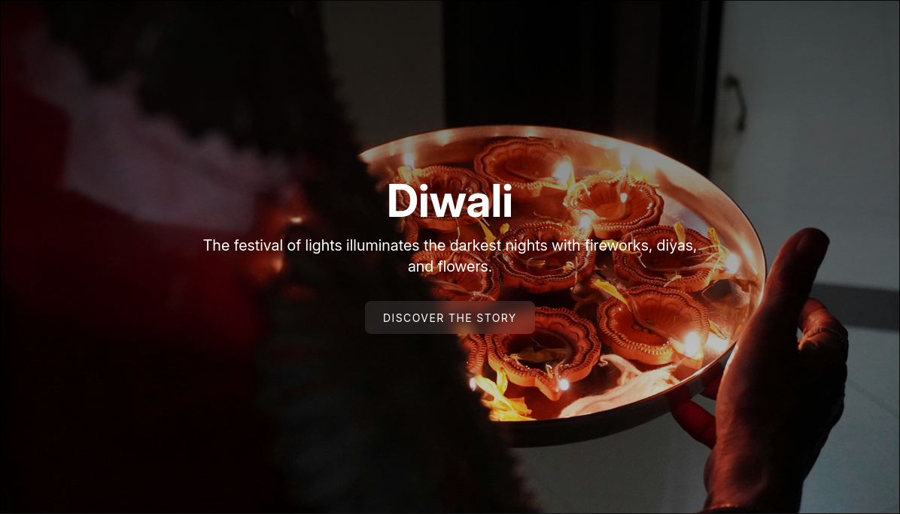

# Falling Seasons

**Reimagining 'Fall'**: An animated journey through India's vibrant festive season.
Made with ❤️ for [HackClub](hackclub.siege.com) <br><br>
Demo Link: https://falling-seasons.vercel.app/



---

## Introduction

This project is my answer to the question: What does "Fall" mean when you don't have falling leaves or pumpkin carvings? I never celebrated Halloween, It was never collecting leaves for me. So I decided to redefine how Fall is celebrated here...

As someone from India, our 'Fall' is a season of incredible transition... from the final days of the heavy monsoon to the vibrant, radiant celebrations of Ganeshotsav, Navratri, Dussehra and Diwali.

These festivals are not just celebrations to welcome new season, but to gather with your loved ones across the world... They are celebrations for the **victory of justice over evil**

**Falling Seasons** is an animated, scrollable story that celebrates this unique seasonal shift. It's a visual journey through the colors, lights, and festivals that define Autumn for us.

I hope my website will help spread the beauty of my country's culture to the people participating in Siege by Hackclub. Together, we can reimagine a new phase of Fall, one that celebrates diversity and the unique ways this season is experienced around the world.

## Installation

Clone this repository and enter the directory:

```sh
git clone https://github.com/chishxd/falling-seasons.git
cd falling-seasons
```

Install dependencies:

```sh
npm install
```

Start the development server:

```sh
npm run dev
```

The site will be available at `http://localhost:5173` (or another port if 5173 is busy).

## Building for Production

To create a production build:

```sh
npm run build
```

You can preview the production build with:

```sh
npm run preview
```

## Usage

Once the development server is running, simply open your browser and navigate to the provided localhost URL. The website is an interactive, scroll-based experience:

- **Scroll down** to journey through India's festive autumn season
- Experience smooth animations and transitions as you explore each festival
- Immerse yourself in the vibrant colors and cultural celebrations

The site is fully responsive and works great on both desktop and mobile devices!

## Contributing

Contributions are welcome! Whether you want to add more festivals, improve animations, or enhance the storytelling:

1. **Fork** this repository
2. **Create** a new branch (`git checkout -b feature/amazing-feature`)
3. **Commit** your changes (`git commit -m 'Add some amazing feature'`)
4. **Push** to the branch (`git push origin feature/amazing-feature`)
5. **Open** a Pull Request

Feel free to open an issue if you have suggestions or find any bugs!

## License

This project is open source and available under the [MIT License](LICENSE).

## Acknowledgments

- Made with ❤️ for [Hack Club Siege](https://hackclub.siege.com)
- Celebrating the vibrant festivals and culture of India
- Thanks to everyone who helped reimagine what "Fall" can mean around the world
